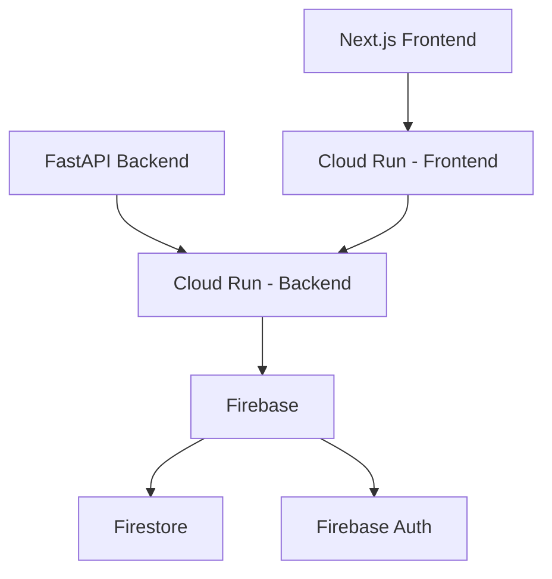

# 技術スタック詳細

## 1. 概要

JDLコンストラクター管理システムは、フロントエンドとバックエンドを分離したマイクロサービス的アプローチを採用し、Google Cloud Platform (GCP) のCloud Run上で動作するシステムです。

### 1.1 主要コンポーネント
- フロントエンド: Next.js (TypeScript) + Tailwind CSS
- バックエンド: FastAPI (Python)
- データベース: Firebase (Firestore)
- インフラストラクチャ: Google Cloud Platform (Cloud Run)

### 1.2 アーキテクチャ図


## 2. フロントエンド (Next.js + Tailwind CSS)

### 2.1 技術選定理由
- TypeScriptによる型安全性
- App Routerによる効率的なルーティング
- Server Componentsによるパフォーマンス最適化
- Tailwind CSSによる効率的なUI開発
- Google認証との容易な統合

### 2.2 主要ライブラリ
- Tailwind CSS: ユーティリティファーストのCSSフレームワーク
  - @tailwindcss/forms: フォーム要素の最適化
  - @tailwindcss/typography: タイポグラフィの最適化
  - @tailwindcss/aspect-ratio: アスペクト比の制御
- React Query: サーバーステート管理
- Zustand: クライアントステート管理

### 2.3 デザインシステム
```javascript
// tailwind.config.js
module.exports = {
  content: [
    './src/pages/**/*.{js,ts,jsx,tsx}',
    './src/components/**/*.{js,ts,jsx,tsx}',
    './src/app/**/*.{js,ts,jsx,tsx}',
  ],
  theme: {
    extend: {
      colors: {
        primary: {
          50: '#f0f9ff',
          100: '#e0f2fe',
          // ... カラーパレット
          900: '#0c4a6e',
        },
        secondary: {
          // セカンダリカラー定義
        },
      },
      // その他のカスタマイズ
    },
  },
  plugins: [
    require('@tailwindcss/forms'),
    require('@tailwindcss/typography'),
    require('@tailwindcss/aspect-ratio'),
  ],
}
```

## 3. バックエンド (FastAPI)

### 3.1 技術選定理由
- 高速なAPI開発
- 自動API文書生成
- 型安全性とバリデーション
- 非同期処理のサポート

### 3.2 主要機能
- RESTful APIエンドポイント
- Firebase認証統合
- バリデーションと例外処理
- ロギングとモニタリング

## 4. データベース (Firebase)

### 4.1 技術選定理由
- サーバーレスアーキテクチャ
- リアルタイムデータ同期
- 認証機能の統合
- コスト効率の良い料金体系

### 4.2 データモデル
```typescript
interface Collections {
  teams: {
    [teamId: string]: {
      name: string;
      description?: string;
      managerId: string;
      createdAt: Timestamp;
      updatedAt: Timestamp;
      players: {
        [playerId: string]: {
          name: string;
          jdlId: string;
          class: string;
          joinedAt: Timestamp;
        }
      }
    }
  };
  
  tournaments: {
    [tournamentId: string]: {
      name: string;
      startDate: Timestamp;
      endDate: Timestamp;
      rounds: {
        [roundId: string]: {
          date: Timestamp;
          entries: {
            [entryId: string]: {
              playerId: string;
              teamId: string;
              class: string;
              points: number;
            }
          }
        }
      }
    }
  };
}
```

## 5. インフラストラクチャ

### 5.1 Cloud Run設定
- リージョン: asia-northeast1
- メモリ: 256Mi
- CPU: 1
- 最小インスタンス数: 0

### 5.2 デプロイメント設定
```yaml
steps:
- name: 'gcr.io/cloud-builders/docker'
  args: ['build', '-t', 'gcr.io/$PROJECT_ID/fastapi-backend', './backend']
- name: 'gcr.io/cloud-builders/docker'
  args: ['push', 'gcr.io/$PROJECT_ID/fastapi-backend']
- name: 'gcr.io/google.com/cloudsdktool/cloud-sdk'
  entrypoint: gcloud
  args:
  - 'run'
  - 'deploy'
  - 'fastapi-backend'
  - '--image'
  - 'gcr.io/$PROJECT_ID/fastapi-backend'
  - '--region'
  - 'asia-northeast1'
  - '--platform'
  - 'managed'
  - '--memory'
  - '256Mi'
  - '--cpu'
  - '1'
```

## 6. セキュリティ

### 6.1 認証・認可
- Firebase Authentication
- JWTトークン検証
- CORS設定
- セキュアヘッダー

### 6.2 データ保護
- Firestoreセキュリティルール
- データ暗号化
- アクセス制御

## 7. 監視・ロギング

### 7.1 ログ管理
- Cloud Logging
- 構造化ログ
- エラートラッキング

### 7.2 モニタリング
- Cloud Monitoring
- パフォーマンス指標
- アラート設定

## 8. コスト最適化

### 8.1 Firebase (Spark Plan - 無料枠)
- 認証: 月間10万人まで
- Firestore: 1GB保存 + 50,000読み取り/日
- リアルタイムデータベース: 1GB保存

### 8.2 Cloud Run
- 従量課金制
- 最小インスタンス数: 0
- リソース最適化設定

## 9. 開発フロー

### 9.1 ローカル開発環境
```bash
# バックエンド起動
cd backend
python -m venv venv
source venv/bin/activate
pip install -r requirements.txt
uvicorn main:app --reload

# フロントエンド起動
cd frontend
npm install
npm run dev
```

### 9.2 CI/CD
- GitHub Actions
- Cloud Build
- 自動テスト
- 自動デプロイ 